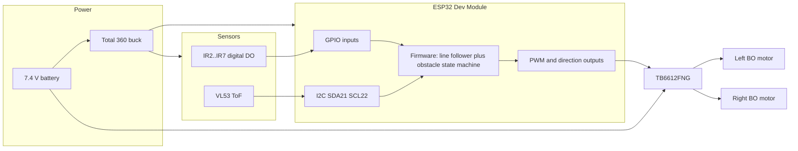
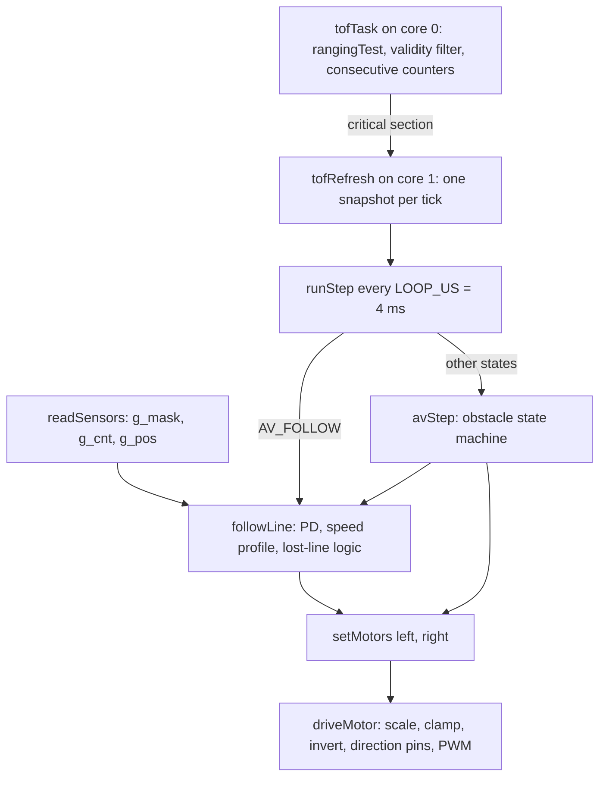
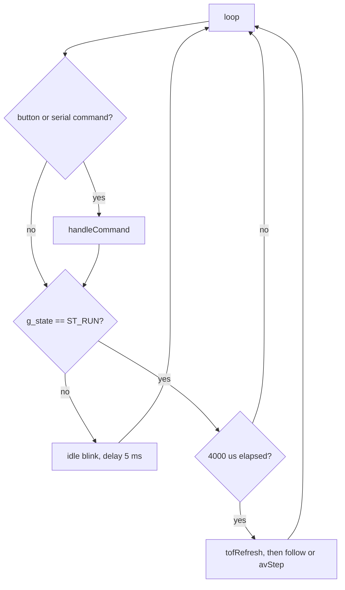

# System architecture diagrams

## Hardware

```mermaid
flowchart LR
  subgraph PWR["Power"]
    BAT["7.4 V battery"]
    BUCK["Total 360 buck"]
  end
  subgraph SENS["Sensors"]
    IR["IR2..IR7 digital DO"]
    TOF["VL53 ToF"]
  end
  subgraph MCU["ESP32 Dev Module"]
    GPIO["GPIO inputs"]
    I2C["I2C SDA21 SCL22"]
    LOGIC["Firmware: line follower plus obstacle state machine"]
    PWM["PWM and direction outputs"]
  end
  DRV["TB6612FNG"]
  ML["Left BO motor"]
  MR["Right BO motor"]
  BAT --> BUCK
  BAT --> DRV
  BUCK --> MCU
  BUCK --> SENS
  IR --> GPIO
  TOF --> I2C
  GPIO --> LOGIC
  I2C --> LOGIC
  LOGIC --> PWM
  PWM --> DRV
  DRV --> ML
  DRV --> MR
```

## Software data flow

```mermaid
flowchart TD
  T["tofTask on core 0: rangingTest, validity filter, consecutive counters"] -->|critical section| R["tofRefresh on core 1: one snapshot per tick"]
  S["readSensors: g_mask, g_cnt, g_pos"] --> F["followLine: PD, speed profile, lost-line logic"]
  R --> RS["runStep every LOOP_US = 4 ms"]
  RS -->|AV_FOLLOW| F
  RS -->|other states| A["avStep: obstacle state machine"]
  A --> F
  F --> M["setMotors left, right"]
  A --> M
  M --> D["driveMotor: scale, clamp, invert, direction pins, PWM"]
```

## Control loop

```mermaid
flowchart TD
  L["loop"] --> B{"button or serial command?"}
  B -->|yes| H["handleCommand"]
  B -->|no| C{"g_state == ST_RUN?"}
  H --> C
  C -->|no| I["idle blink, delay 5 ms"]
  C -->|yes| T{"4000 us elapsed?"}
  T -->|no| L
  T -->|yes| X["tofRefresh, then follow or avStep"]
  X --> L
  I --> L
```
